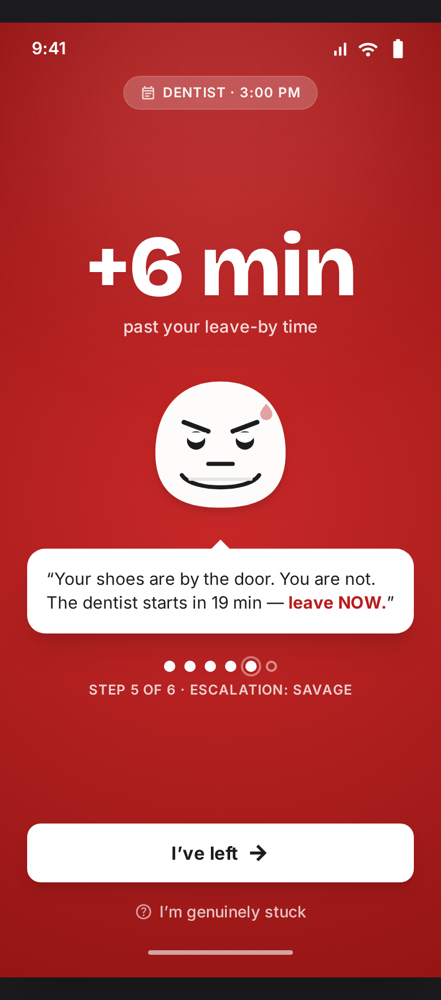
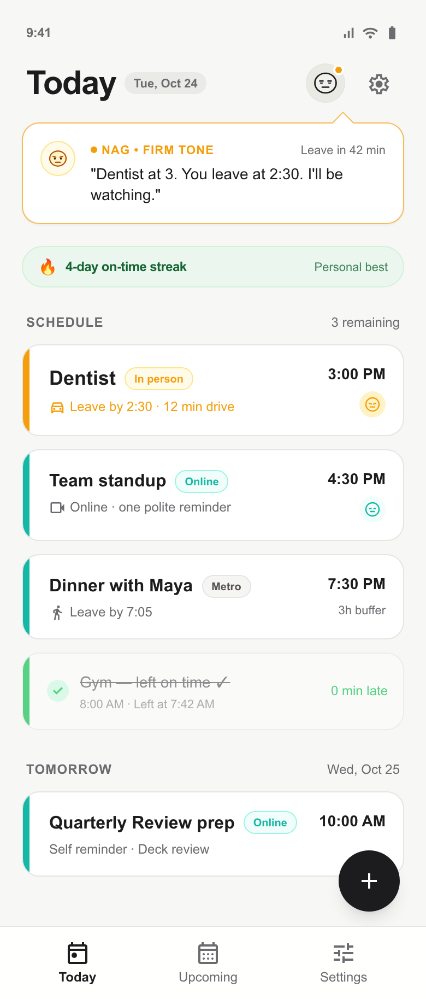
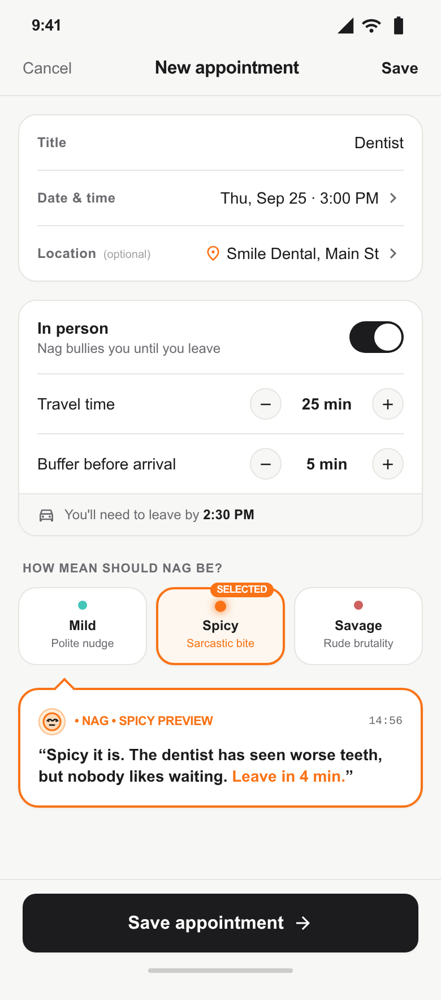
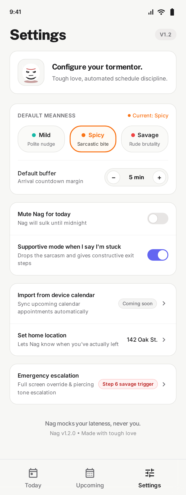
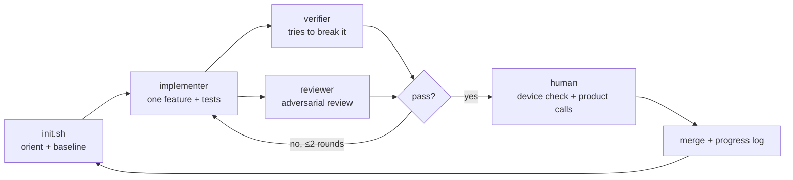
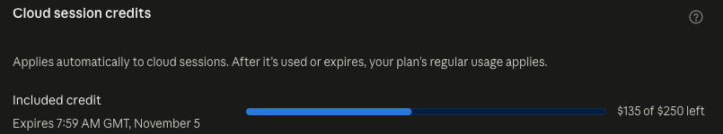

# Nag — a reminders app that bullies you out the door

> A reminders app whose notifications get progressively ruder until you actually leave the house.
> Also: an experiment in **harness engineering** with cloud coding agents and a human in the loop.

<p align="center">
  
</p>

## What this is (and isn't)

This is a **fun experiment**, not a product. I wanted to see what happens when you give coding
agents a properly engineered harness — structured knowledge, mechanical checks, a sequential
memory — and stay in the loop only where a human is actually needed.

**Status:** v1 is done (features F000–F008). Every feature was device-checked on an iPhone in
Expo Go. Android is untested.

## What prompted this

I was talking to a friend and she suggested, jokingly, an app that "bullies you until you leave
the house." I, being an absolute idiot, completely missed that she was being funny — and that she
actually meant it as a fix for a real problem of mine: forgetting things, because there are so many
things I'm working on or going through my head at any given time.

So I built it. Big thanks to her for the idea (and the gentle roast).

## The app in 30 seconds

You add an appointment with its travel time. The app works out your **leave-by** time and, for
in-person events, sends up to six notifications that escalate in tone:

| Step | When (vs. leave-by) | Tone |
|---|---|---|
| 1 | −30 min | polite |
| 2 | −10 min | firm |
| 3 | 0 | sarcastic |
| 4 | +3 min | rude |
| 5 | +6 min | savage |
| 6 | +10 min | unhinged |

Nag, the deadpan blob mascot, mocks the **lateness, never the person**:

> *"Is the plan to arrive by wishing? Leave now."*
> *"Your keys have seen enough. 3 min late."*
> *"I've started narrating this to the houseplants."*

- **"I've left"** (on the notification or in the app) stops the series.
- **"I'm genuinely stuck"** switches to at most two supportive messages, with no lateness count.
- Online events get one polite "starts in N min" reminder instead.
- Settings: default meanness (Mild / Spicy / Savage), default buffer, and "Mute Nag for today".

<p align="center">
  
  
  
</p>

<sub>These are the Stitch design mockups the agents built from; the real app follows them, with the
deviations listed in `docs/design/README.md`.</sub>

## The experiment

What I wanted to explore:

- **Harness engineering in practice**, borrowing from OpenAI's
  [harness engineering](https://openai.com/index/harness-engineering/) write-up and Anthropic's
  [effective harnesses for long-running agents](https://www.anthropic.com/engineering/effective-harnesses-for-long-running-agents).
- **Principles from Zachary Huang's [Crack Any Codebase with AI](https://www.manning.com/books/crack-any-codebase-with-ai)**
  (Manning MEAP): code is cheap now and understanding is the bottleneck, so give agents a map of
  the codebase and let them decide what to read, instead of stuffing everything into the prompt.
- **Claude Code cloud sessions with a human in the loop**: agents build and verify, I run the
  device checks, make product calls and merge.
- **Stitch (Google) as a design step** feeding coding agents.
- **Research and ideation with AI tools**: Claude's search tools and parallel research agents,
  plus a devil's-advocate agent to challenge the idea before a line of code was written.

### How I ran it

Two Claude Code sessions, two roles:

- **Cloud sessions did the building.** Each feature ran through the agent loop in a Claude Code
  cloud session on its own branch, ending in a PR. I supervised: read every report, answered product
  questions, and decided what to send back.
- **A local session on my laptop did the double-checking and kept the loop running.** For every
  PR it pulled the branch, re-ran all the checks on a real machine, started the dev server for my
  iPhone, read the logs, and drafted my replies to the cloud agent. It also did the one-off work the
  cloud couldn't: the Stitch design pass, the GitHub setup, and the pre-publish security scan.
- **I was the only one with a phone.** Every device check was mine, and I merged every PR.

## How it's built: the harness

### Knowledge structure and layers

Agents are only as good as what they can find. The repo is organised so an agent with no memory
of previous sessions can orient itself in a minute:

- **`AGENTS.md` is a map, not a manual.** A short file that says where everything lives, who owns
  which fact, and which source wins when two disagree (code + passing checks > docs > memories).
- **`docs/` is the system of record**: product rules (`PLAN.md`), architecture, golden principles,
  design system, tech debt, and an exec plan per feature. Agents read only what their task touches
  (progressive disclosure).
- **Layered code with one-way dependencies**: `types → domain → services → state → ui → app`.
  `scripts/check-architecture.mjs` enforces it, and every error message tells the agent *how to fix
  it*. A Claude Code hook runs it after every edit.

### A sequential memory that's updated every time

- `harness/feature_list.json` — every feature with its verify steps, all starting as failing.
  Agents may only flip `passes` and add notes.
- `harness/progress.md` — an **append-only** log. Every session reads the tail, does one feature,
  and appends what happened and what's next.

That memory is sequential for a reason: it matches how the agents work, and how the underlying
LLMs work. A transformer generates one token at a time, each conditioned on everything before it,
with its context (literally, the KV cache) growing append-only. The progress log is the same idea
one level up — an append-only context that each new session conditions on.

It's also **context engineering**: the repo decides what enters a fresh agent's context window.
Once `AGENTS.md`, the log tail and an exec plan are in the window, they become contextual
embeddings that shape everything the model does next. The harness is really a way of curating
those embeddings across sessions that don't share any memory.

### The loop



`/next-feature` runs it. Agent definitions live in `.claude/agents/`.

### About the recursion

Yes, this is a loop — but it isn't a [Ralph loop](https://ghuntley.com/ralph/). Ralph cheerfully
says *"I'm helping!"*; here a verifier deliberately breaks the code to check that the tests would
notice.

The abstractions are recursive all the way down: an agent nags other agents into building an app
that nags a human, while the human nags the cloud agent about its branches — and it's all
remembered in an append-only log, the same way the model underneath remembers its own tokens.
Loops all the way down. At some point one of them has to actually leave the house.

## What happened

- **9 features, 8 PRs, 444 tests.** The design pass ran locally; the other eight features were
  built in cloud sessions and device-checked on my iPhone.
- The verifier deliberately broke the code **up to 21 different ways per feature** to prove the
  tests catch it.
- Moments worth noting:
  - **The midnight bug:** a test used the real clock, so it only failed late in the evening. The
    cloud never saw it; my laptop did. Fix: time is injected everywhere, and a new mechanical check
    bans real-clock reads.
  - **Stale generated files:** typecheck broke locally because of leftover Expo route types. The
    fix made the gate deterministic.
  - **The iOS notification buttons** didn't show. The easy answer was "Expo Go limitation"; the real
    answer was a race condition in our category registration, found by reading the native source.
  - **Stitch's mockup** had Nag say the dentist "has seen worse teeth" — mocking the person, which
    breaks rule #2. The docs overruled the mockup.
  - **Branch reuse:** a merged PR's branch got reused, so no new PR appeared. The local session
    caught it and opened the PR.

### What it cost

| Item | Cost |
|---|---|
| Claude Code cloud sessions (all building, verifying and reviewing) | **≈ $115** of a $250 cloud-session credit |
| Local Claude Code session (double-checks, design pass, GitHub setup) | Included in my Claude Max (5x) plan, not metered separately |
| Claude API | $0 — v1 has no API calls; that starts in v2 |

<p align="center">
  
</p>

<sub>Cloud-session credit remaining after v1 was built ($250 − $135 ≈ $115 spent).</sub>

## What I learned

- **The harness matters more than the prompt.** Agents with no memory of previous sessions picked
  up exactly where the last one stopped, because the repo told them where they were. When a
  decision wasn't written down, it effectively didn't exist.
- **How knowledge is stored and connected matters as much as what's stored.** The repo's
  knowledge is layered, and each layer points to the next:
  - `AGENTS.md` is the entry point: a short map that says where everything lives.
  - `docs/` holds the durable facts: product rules, architecture, principles, design.
  - `harness/` holds the moving state: which features pass, and an append-only log of what
    happened.
  - Each feature's exec plan holds the *why* behind its decisions.
  - The code itself is layered the same way, with dependencies allowed in one direction only.

  An agent starts at the map and follows links to only what its task needs, the way you'd navigate
  a well-organised wiki rather than read it cover to cover.
- **One source of truth, or the agents drift.** Every fact has exactly one owner file; everything
  else links to it, and when two sources disagree there's a fixed order of who wins (code and
  passing checks, then docs, then memories). Early on, progress was tracked in two places — the
  plan's checkboxes and the feature list — and I removed the duplicate before they drifted apart.
  That one "who owns which fact" table did more work than any instruction.
- **Every bug should become a rule.** Agents don't remember past sessions, so if a bug is only
  fixed, a later agent can happily make the same mistake again. The fix is to turn each bug into
  an **automated check that fails the build**, with an error message that explains how to do it
  properly. Then the repo remembers the lesson on the agents' behalf. Three examples from this
  project:
  - **The midnight bug.** A test created an appointment "90 minutes from now" using the real
    clock, so it only failed if you ran it late in the evening, when 90 minutes later is tomorrow.
    The fix was to pass a fixed time into the code; the *rule* is a check that now fails if any
    test or app code reads the real clock directly.
  - **Stale generated files.** Typecheck broke on my laptop because of leftover files Expo had
    generated earlier. The rule: the check ignores those generated files, and a separate check
    makes sure every screen link points to a screen that exists.
  - **An Android crash.** A notifications import would have crashed the app on Android in Expo Go.
    The rule: a check blocks that import from ever coming back.

  Each mistake made the harness a little stricter, so it couldn't happen twice. It's like writing
  a test, but for the *process* rather than the code.
- **LLMs reason sequentially, and it shows.** The agents were confident about the next step and
  usually right. When they were wrong, it was with a plausible first explanation, and asking for
  evidence is what turned that into the real fix. The clearest case was **Expo Go**:
  - *Expo Go* is Expo's app for trying your project on a real phone without building and
    installing it: your laptop serves the code over Wi-Fi and Expo Go runs it. Because one Expo Go
    app runs everyone's projects, some native features behave differently in it than in a real,
    installed app.
  - On my iPhone, notifications arrived, but long-pressing them showed no "I've left" or "I'm
    genuinely stuck" buttons. The easy explanation, which the local session reached for first, was
    "that's an Expo Go limitation — it'll work in a real build."
  - Instead of accepting that, I had the cloud agent check the registration code and cite evidence
    rather than guess. It read the native iOS source and found a **race condition** in our own
    code: the app registered its two sets of notification buttons at the same time, and on first
    launch one could silently overwrite the other.
  - The fix was to register them one at a time and then confirm iOS actually kept both (the dev
    server now logs them). On the re-test, the buttons appeared. It was never Expo Go's fault.
- **Feedback loops beat single passes.** A verifier trying to break the code, a reviewer looking
  for problems, and a mechanical check all catch different things. Two fix rounds were usually
  enough.
- **Different environments, different blind spots.** The cloud never saw the midnight bug or the
  stale files; my laptop did. Only a real phone found the missing notification buttons. Running a
  local session alongside the cloud one was worth it.
- **The human is needed at the edges.** Device checks, product calls (how gentle "stuck" mode
  should be, what an online reminder should say), and process slips like a reused branch. The
  agents handled most of the middle.
- **Challenge the idea before building it.** The devil's-advocate round changed the design before
  any code: "I've left" can't be a free off-switch, only in-person events escalate, cap the alerts.
- **Design tools overreach; docs must win.** Stitch was fast and good, but its mockups added
  features and a line that broke the rules. Writing the deviations down let the agents follow the
  docs, not the pictures.
- **Next time:** start every feature from a fresh branch automatically, add CI on GitHub, and
  write the device-check checklist into each feature from the start.

## Try it yourself

### Run the app

Prerequisites: Node.js (a current LTS), and **Expo Go** on your phone.

```bash
git clone https://github.com/sammy143/reminders-app.git
cd reminders-app
npm install
npx expo start
```

Scan the QR code with your phone's camera (iOS) or from inside Expo Go (Android). Your phone and
computer need to be on the same Wi-Fi; if they can't be, use `npx expo start --tunnel`.

If you're signed in to Expo Go, the Expo CLI on your computer must be signed in to the same account
(`npx expo login`, in a regular terminal).

Press `w` to open the web version. It's fine for looking around, but notifications only work on a
phone.

### Test it

- **Everything automated:** `bash scripts/check.sh` runs architecture checks, lint, typecheck and
  all tests.
- **Notifications on a phone:** create an **in-person** event starting about 2 minutes from now,
  with travel 0, buffer 0 and **Savage**. Allow notifications when asked, lock the phone, and wait
  for Nag. Long-press a notification for **"I've left"** and **"I'm genuinely stuck"**.

### Run the agent loop

Open the repo in [Claude Code](https://claude.com/claude-code), locally or as a cloud session, and
run `/next-feature`. It picks the next failing feature in `harness/feature_list.json` and runs the
loop above.

- The project hook in `.claude/settings.json` runs the architecture check after every file edit.
- Serena or other code-navigation MCP servers are optional; nothing depends on them.

## Roadmap

- **v2:** Nag's lines written by Claude, through a small Cloudflare Worker proxy so no API key ever
  ships in the app, with the fixed lines as an offline fallback.
- **v3:** detecting that you've actually left home (geofencing, in a development build), plus
  on-time streaks.

## Credits

- OpenAI — [Harness engineering](https://openai.com/index/harness-engineering/)
- Anthropic — [Effective harnesses for long-running agents](https://www.anthropic.com/engineering/effective-harnesses-for-long-running-agents)
- Zachary Huang — [Crack Any Codebase with AI](https://www.manning.com/books/crack-any-codebase-with-ai) (Manning MEAP)
- Geoffrey Huntley — [Ralph](https://ghuntley.com/ralph/)
- Design mockups made with Google Stitch; built with Expo, React Native and NativeWind.
- My friend, for the idea.

## License

[MIT](LICENSE)
